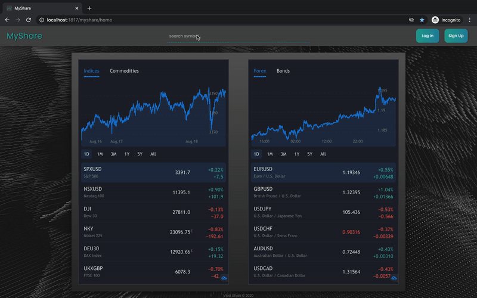
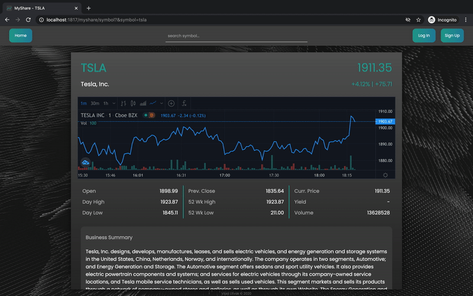
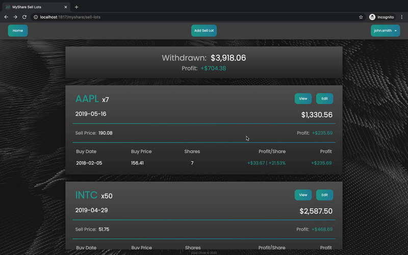
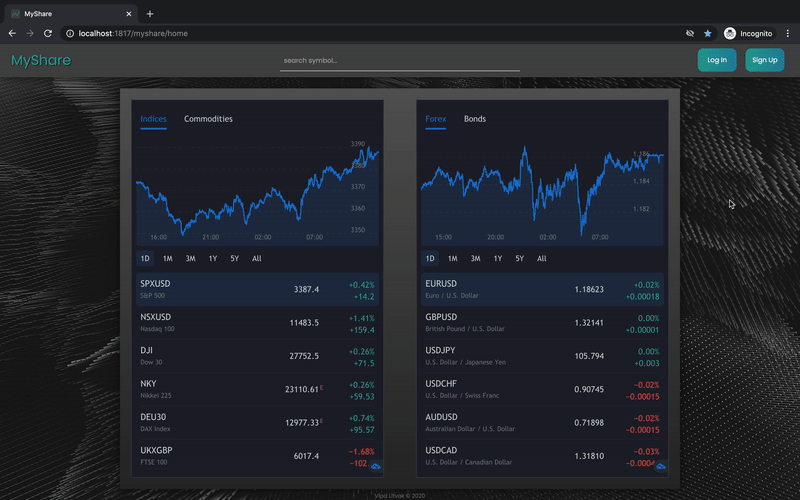
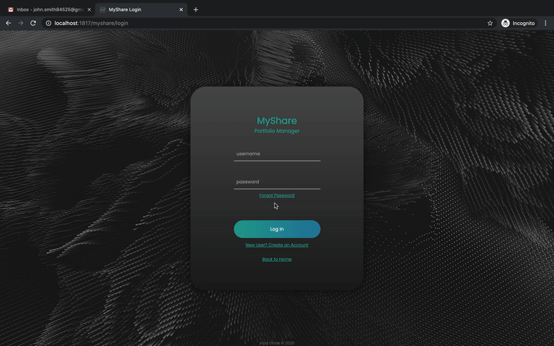
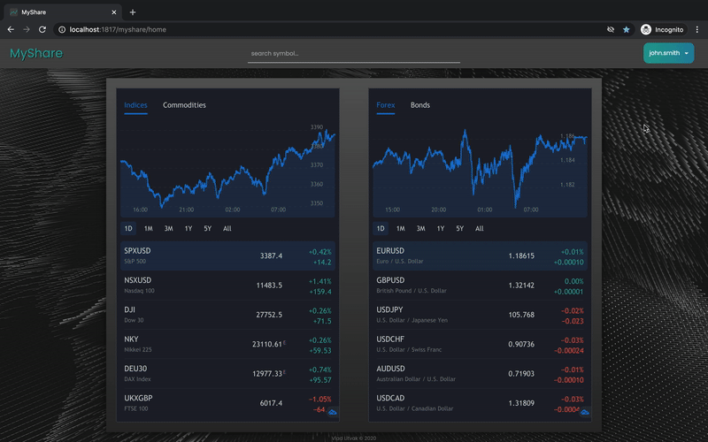

# MyShare Portfolio Manager

### [See Demos](#symbol-lookup)

### DESCRIPTION

- This webapp manages users' stock portfolios - showing holdings, lots, and sells.
  - It shows users the profit they have made from selling, and the value increase of their current holdings.
  - It also gives users access to live stock information of any symbol.
- The webapp is hosted locally by running as a Python Flask app.
- The Flask app hosts all the pages of the app, along with API endpoints used by the front end.
- Yahoo Finance APIs are used to get current stock information.
 

### FILE INFO

- [**MyShareApi.py3**](MyShareApi.py3) defines logic for API endpoints and hosts the front end pages.
  - User information is gathered and stored by connecting to the MyShare database.
  - Live stock information is gathered from Yahoo Finance APIs.
  - Passwords are encrypted using `passlib.hash.sha256_crypt` before being inserted into the database.
  - The API is hosted on localhost port 1817.

- The [**database**](database) folder contains the MyShare database (SQLite) and the SQL used to create it. The database includes:
  - a `Users` table
  - a `Holdings` table
  - a `PasswordReset` table
  - a trigger which automatically removes password reset codes that are more than 5 minutes old
  - multiple indexes to make common queries more efficient

- The [**templates**](templates) folder contains the HTML for all front end webpages.

- The [**static/js**](static/js) folder contains the JavaScript for all front end webpages.

- The [**static/css**](static/css) folder contains the CSS for all front end webpages.

 

### API FUNCTIONALITY
 
- For API information, including available endpoints, their functionality, and input/output formats, see [MyShare API Documentation](https://app.swaggerhub.com/apis-docs/vlitvak99/MyShare/MyShare-Portfolio-Manager).
- For API error code information, see [**MyShare API Error Codes.pdf**](MyShare%20API%20Error%20Codes.pdf).
 

### PROGRAM SETUP

- Download this repo and make sure python3 and pip3 are installed on your machine.
- Run [**PipInstalls.sh**](PipInstalls.sh) to make sure all required python dependencies are installed.
- To enable password recovery through email *(optional)*:
  - Set up a Gmail account to be used as the MyShare system email (using a personal email is not reccomended, as security settings will need to be turned off).
  - Go to https://myaccount.google.com/lesssecureapps and turn *"Allow less secure apps"* on.
  - Put the account's email address as the `ADMIN_EMAIL_ADDRESS` value and the account's password as the `ADMIN_EMAIL_PASSWORD` value in lines 19 and 20 of [**MyShareApi.py3**](MyShareApi.py3).
- Navigate to this directory and run the Flask app:
  > `$ python3 MyShareApi.py3`
- Visit the MyShare home page http://localhost:1817/myshare/home
 
 

   
  <h2>Symbol Lookup</h2>
  
   
   
  <h2>Live Stock Prices</h2>
  
   
   
  <h2>Holdings</h2>
  
   
   
  <h2>Lots</h2>
  
   
   
  <h2>Sell Lots</h2>
  
   
   
  <h2>Create Account</h2>
  
   
   
  <h2>Password Recovery</h2>
  
   
   
  <h2>Login</h2>
  
   
   
  <h2>Update Account Info</h2>
  

